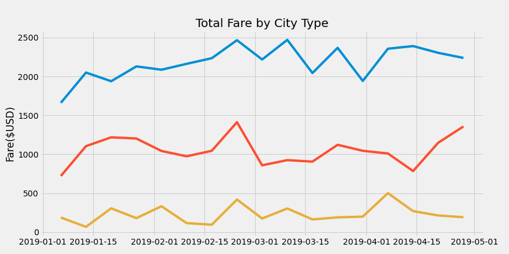

# PyBer_Analysis
Python analysis using MatPlotLib

## Project OverView
PyBer, a ride-sharing app wants to analyze data from January to early May 2019.

1. Calculate the total number of rides.
2. Calculate the total fares.
3. Calculate the total number of drivers.
4. Calculate the average fare per ride for each city type.
5. Calculate the average fare per driver for each city type.
6. Display a summary of total rides, total drivers, total fares, average fares per ride, and average fare per driver by city type.
7. Create a multiple line graph displaying fares by city type from Jan to Early May 2019.

## Resources
- Data Source: city_data.csv, ride_data_csv, PyBer_ride_data.csv
- Software: Python 3.8.2, 
- Visual Studio Code, 1.52.1

## Summary
### The analysis of Pyber share-riding data show that:  

#### The three city types were:
- Urban
- Suburban
- Rural

#### The three factors were:
- Ride counts
- Fare totals
- Number of drivers

##### The analysis results were:
- Urban cities type has the most consistent usage of ride-sharing and potential to make more money per driver.
- Followed by suburban cites making about half of what urban cities make.
- Rural cities do not have the users to make a substantial income.

## PyBer Analysis Summary

This analysis shows the differences of users using PyBer amongst city types.  Rural areas lack the traffic for drivers to capitalize in making an income due to less users requesting a ride. 
